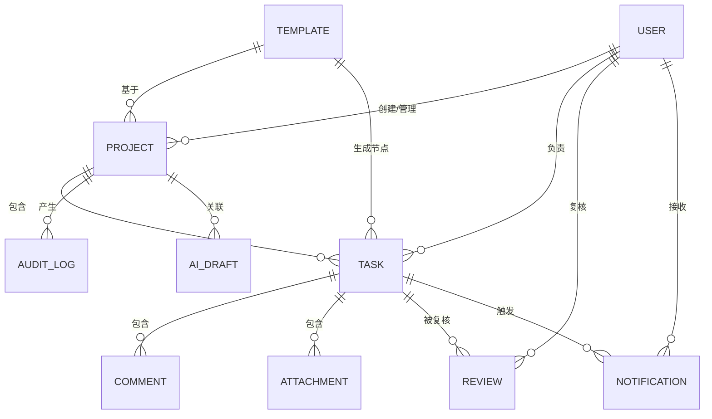
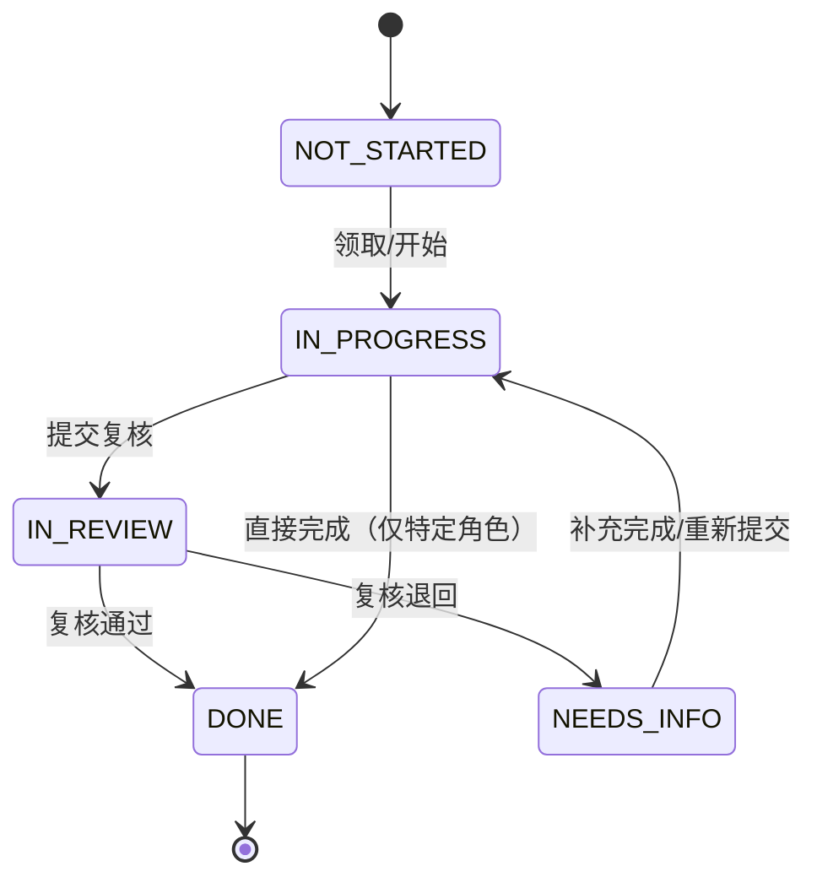

# PV智枢 — 产品完善设计文档（方案 A / 轻量补全）

> 用途：初赛 demo 配套的产品补全文档，解决 PRD 中的待确认项，补充数据模型、API 和指标体系。
> 日期：2026-06-26

---

## 一、PRD 待确认项决策

以下决策基于"初赛只提交 demo"的约束，优先保证可演示、可理解。

| 原待确认项 | 决策 | 理由 |
|---|---|---|
| 纯 Web vs 同时支持移动端 | 纯 Web MVP，移动端延后到后续迭代 | 浏览器即可完整演示所有角色视角，移动端增加 30%+ 开发量 |
| 是否接入现有安全数据库 | 不接入，采用独立数据层 | 降低集成复杂度，demo 自包含；后续通过 API 扩展 |
| 首批服务对象 | 药企内部 PV 团队 | 当前角色模型（PM/Processor/Physician/QA）已覆盖此场景 |
| 邮件提醒 | 站内通知即可，邮件提醒延后 | MVP 阶段站内通知已能演示提醒能力；邮件需配置 SMTP 服务 |
| 审计包导出格式 | 先支持 HTML 导出，PDF 延后 | HTML 导出已实现，PDF 需要引入 puppeteer/pdf-lib 等库 |
| AI 助手数据源 | 基于项目内已有任务/评论/附件生成草稿 | 不接入外部医学数据库，避免合规风险 |

---

## 二、数据模型

### 2.1 实体关系图



### 2.2 核心实体字段

#### User（用户）

| 字段 | 类型 | 约束 | 说明 |
|---|---|---|---|
| id | string (UUID) | PK | 用户唯一标识 |
| name | string | 必填，最长 40 字 | 显示名称 |
| role | enum | 必填 | PM / PROCESSOR / PHYSICIAN / QA / VENDOR / ADMIN |
| email | string | 可选 | 邮箱 |
| org | string | 可选 | 组织/部门 |
| avatar | string | 可选 | 头像 URL |
| createdAt | datetime | 必填 | 创建时间 |

**角色说明**：
- PM：PV 项目经理
- PROCESSOR：Case Processor（病例处理员）
- PHYSICIAN：Safety Physician（安全医师）
- QA：QA / 质量
- VENDOR：CRO 供应商
- ADMIN：系统管理员

#### Project（项目）

| 字段 | 类型 | 约束 | 说明 |
|---|---|---|---|
| id | string (UUID) | PK | 项目唯一标识 |
| name | string | 必填，最长 60 字 | 项目名称 |
| code | string | 必填 | 项目编号 |
| product | string | 必填 | 产品线 |
| region | string | 必填 | 国家/地区 |
| type | enum | 必填 | ICSR / INQUIRY / CAPA / PSUR |
| status | enum | 必填，默认 ACTIVE | ACTIVE（进行中）/ CLOSED（已完成/归档） |
| ownerId | string (UUID) | FK → User | 项目负责人 |
| memberIds | string[] (UUID) | 可选 | 团队成员列表 |
| templateId | string (UUID) | FK → Template | 关联模板 |
| startDate | datetime | 必填 | 开始时间 |
| endDate | datetime | 可选 | 结束时间 |
| progress | number | 默认 0 | 完成进度 0-100 |
| description | string | 可选 | 项目描述 |

**项目类型说明**：
- ICSR：个例安全报告（Individual Case Safety Report）
- INQUIRY：监管问询
- CAPA：CAPA 整改
- PSUR：定期安全更新报告

#### Task（任务）

| 字段 | 类型 | 约束 | 说明 |
|---|---|---|---|
| id | string (UUID) | PK | 任务唯一标识 |
| projectId | string (UUID) | FK → Project | 所属项目 |
| title | string | 必填，最长 120 字 | 任务标题 |
| description | string | 可选 | 任务描述 |
| type | string | 必填 | 任务类型（如随访、医学评估等） |
| status | enum | 必填，默认 NOT_STARTED | 详见状态机章节 |
| priority | enum | 必填，默认 P2 | P0（紧急）/ P1（高）/ P2（常规） |
| assigneeId | string (UUID) | FK → User | 负责人 |
| reviewerId | string (UUID) | FK → User | 复核人 |
| dueAt | datetime | 必填 | 截止时间（ISO 格式） |
| riskLevel | enum | 必填，默认 MEDIUM | HIGH / MEDIUM / LOW |
| requiredEvidence | string[] | 可选 | 必填证据描述列表 |
| evidenceUploaded | string[] | 默认 [] | 已上传的证据 ID 列表 |
| caseId | string | 可选 | 关联病例编号 |
| product | string | 可选 | 产品线 |
| region | string | 可选 | 国家/地区 |
| severity | enum | 可选 | MILD / MODERATE / SEVERE / LIFE_THREATENING |
| seriousness | enum | 可选 | SERIOUS / NON_SERIOUS |
| dayZero | string | 可选 | 首次收到安全信息的日期 |
| medicalOpinion | string | 可选 | 医学评估意见 |
| followUpStatus | enum | 可选 | NONE / PENDING / COMPLETED |
| createdAt | datetime | 必填 | 创建时间 |
| updatedAt | datetime | 必填 | 更新时间 |

#### Comment（评论）

| 字段 | 类型 | 约束 | 说明 |
|---|---|---|---|
| id | string (UUID) | PK | 评论唯一标识 |
| taskId | string (UUID) | FK → Task | 所属任务 |
| authorId | string (UUID) | FK → User | 作者 |
| content | string | 必填，最长 2000 字 | 评论内容 |
| mentions | string[] | 可选 | 提及的用户 ID 列表 |
| createdAt | datetime | 必填 | 创建时间 |

#### Attachment（附件）

| 字段 | 类型 | 约束 | 说明 |
|---|---|---|---|
| id | string (UUID) | PK | 附件唯一标识 |
| taskId | string (UUID) | FK → Task | 所属任务 |
| fileName | string | 必填 | 文件名 |
| size | number | 必填 | 文件大小（字节） |
| type | string | 必填 | MIME 类型 |
| version | number | 默认 1 | 版本号 |
| uploaderId | string (UUID) | FK → User | 上传者 |
| evidenceKey | string | 可选 | 对应的必填证据 key |
| createdAt | datetime | 必填 | 上传时间 |

#### Review（复核记录）

| 字段 | 类型 | 约束 | 说明 |
|---|---|---|---|
| id | string (UUID) | PK | 复核记录唯一标识 |
| taskId | string (UUID) | FK → Task | 被复核的任务 |
| reviewerId | string (UUID) | FK → User | 复核人 |
| decision | enum | 必填 | APPROVED（通过）/ RETURNED（退回） |
| reason | string | 可选 | 退回原因 |
| createdAt | datetime | 必填 | 复核时间 |

#### Notification（通知）

| 字段 | 类型 | 约束 | 说明 |
|---|---|---|---|
| id | string (UUID) | PK | 通知唯一标识 |
| userId | string (UUID) | FK → User | 接收通知的用户 |
| source | string | 可选 | 来源（如 taskId） |
| category | enum | 必填 | DEADLINE / OVERDUE / REVIEW / EVIDENCE / SYSTEM |
| content | string | 必填 | 通知内容 |
| status | enum | 默认 UNREAD | UNREAD / READ |
| createdAt | datetime | 必填 | 创建时间 |

#### AuditLog（审计日志）

| 字段 | 类型 | 约束 | 说明 |
|---|---|---|---|
| id | string (UUID) | PK | 日志唯一标识 |
| actorId | string (UUID) | FK → User | 操作者 |
| objectType | enum | 必填 | TASK / PROJECT / TEMPLATE / ATTACHMENT / REVIEW / EXPORT |
| objectId | string (UUID) | 必填 | 被操作对象 ID |
| action | string | 必填 | 操作描述（如"更新状态 IN_PROGRESS → IN_REVIEW"） |
| before | JSON | 可选 | 变更前数据快照 |
| after | JSON | 可选 | 变更后数据快照 |
| createdAt | datetime | 必填 | 操作时间 |

#### Template（项目模板）

| 字段 | 类型 | 约束 | 说明 |
|---|---|---|---|
| id | string (UUID) | PK | 模板唯一标识 |
| name | string | 必填 | 模板名称 |
| type | enum | 必填 | ICSR / INQUIRY / CAPA / PSUR |
| description | string | 可选 | 模板说明 |
| nodes | JSON[] | 必填 | 任务节点数组，详见 TemplateNode |
| reminderThresholds | number[] | 可选 | 距离截止 N 天时提醒的阈值 |

#### TemplateNode（模板任务节点）

| 字段 | 类型 | 约束 | 说明 |
|---|---|---|---|
| id | string (UUID) | PK | 节点唯一标识 |
| title | string | 必填 | 节点标题 |
| type | string | 必填 | 节点类型 |
| defaultRole | enum | 必填 | 默认处理角色 |
| relativeDueDays | number | 必填 | 相对于项目开始日的截止天数 |
| requiredEvidence | string[] | 可选 | 必填证据 key 列表 |
| description | string | 可选 | 节点描述 |

#### AIDraft（AI 草稿）

| 字段 | 类型 | 约束 | 说明 |
|---|---|---|---|
| id | string (UUID) | PK | 草稿唯一标识 |
| projectId | string (UUID) | FK → Project | 关联项目 |
| authorId | string (UUID) | FK → User | 作者 |
| kind | enum | 必填 | WEEKLY / MEETING / CAPA / RISK |
| content | string | 必填 | AI 生成的内容 |
| confirmed | boolean | 默认 false | 是否已确认为正式记录 |
| createdAt | datetime | 必填 | 创建时间 |

---

## 三、核心 API 接口列表

以下 API 采用 RESTful 风格，请求/响应格式为 JSON。认证方式 MVP 阶段可用简单 Token，后续升级为 JWT。

### 3.1 项目相关

| 方法 | 端点 | 说明 |
|---|---|---|
| GET | /api/projects | 项目列表（支持分页、筛选、搜索） |
| POST | /api/projects | 创建项目（基于模板自动生成任务） |
| GET | /api/projects/:id | 项目详情 |
| PUT | /api/projects/:id | 更新项目 |
| DELETE | /api/projects/:id | 归档项目（软删除） |

**创建项目请求示例**：
```json
POST /api/projects
{
  "name": "某药品 ICSR 项目",
  "code": "ICSR-2026-001",
  "type": "ICSR",
  "product": "某药品",
  "region": "中国",
  "description": "某药品个例安全报告处理",
  "templateId": "tpl-icr-001"
}
```

### 3.2 任务相关

| 方法 | 端点 | 说明 |
|---|---|---|
| GET | /api/tasks | 任务列表（支持按项目/状态/风险/负责人筛选） |
| GET | /api/tasks/:id | 任务详情（含评论、附件、审计记录） |
| PUT | /api/tasks/:id/status | 更新任务状态（触发审计日志） |
| PUT | /api/tasks/:id/assign | 分配/重分配任务 |
| POST | /api/tasks/:id/comments | 添加评论 |
| POST | /api/tasks/:id/attachments | 上传附件（触发审计日志） |
| POST | /api/tasks/:id/review | 复核任务（通过/退回） |

**更新任务状态请求示例**：
```json
PUT /api/tasks/:id/status
{
  "status": "IN_REVIEW",
  "reason": "初稿已完成，请复核"
}
```

**复核任务请求示例**：
```json
POST /api/tasks/:id/review
{
  "decision": "APPROVED"
}
// 或
{
  "decision": "RETURNED",
  "reason": "证据材料不完整，需补充随访记录"
}
```

### 3.3 审计相关

| 方法 | 端点 | 说明 |
|---|---|---|
| GET | /api/audit-logs | 审计日志列表（支持按项目/任务/操作者/时间范围筛选） |
| GET | /api/projects/:id/audit-export | 导出项目审计包（HTML 格式） |

### 3.4 模板相关

| 方法 | 端点 | 说明 |
|---|---|---|
| GET | /api/templates | 模板列表 |
| GET | /api/templates/:id | 模板详情 |
| PUT | /api/templates/:id | 更新模板（仅 PM/ADMIN） |

### 3.5 通知相关

| 方法 | 端点 | 说明 |
|---|---|---|
| GET | /api/notifications | 当前用户通知列表 |
| PUT | /api/notifications/:id/read | 标记通知已读 |
| PUT | /api/notifications/read-all | 标记全部已读 |

### 3.6 AI 草稿相关

| 方法 | 端点 | 说明 |
|---|---|---|
| GET | /api/ai-drafts | 当前用户 AI 草稿列表 |
| POST | /api/ai-drafts | 生成 AI 草稿 |
| PUT | /api/ai-drafts/:id/confirm | 确认 AI 草稿 |

### 3.7 通用响应格式

**成功响应**：
```json
{
  "success": true,
  "data": {},
  "message": "操作成功"
}
```

**分页响应**：
```json
{
  "success": true,
  "data": {
    "items": [],
    "total": 100,
    "page": 1,
    "pageSize": 20
  },
  "message": "查询成功"
}
```

**错误响应**：
```json
{
  "success": false,
  "error": {
    "code": "TASK_NOT_FOUND",
    "message": "任务不存在"
  }
}
```

**错误码规范**：
| 错误码 | 说明 |
|---|---|
| VALIDATION_ERROR | 请求参数校验失败 |
| UNAUTHORIZED | 未登录或 Token 过期 |
| FORBIDDEN | 无权限执行此操作 |
| NOT_FOUND | 资源不存在 |
| CONFLICT | 资源冲突（如重复创建） |
| INTERNAL_ERROR | 服务器内部错误 |

---

## 四、任务状态机



**状态说明**：
| 状态值 | 中文 | 说明 |
|---|---|---|
| NOT_STARTED | 未开始 | 任务已创建，尚未开始处理 |
| IN_PROGRESS | 处理中 | 负责人正在处理 |
| IN_REVIEW | 待复核 | 已提交，等待复核 |
| NEEDS_INFO | 需补充 | 复核退回，需要补充材料 |
| DONE | 已完成 | 任务完成 |

**状态转换规则**：
| 转换 | 触发条件 | 权限要求 |
|---|---|---|
| NOT_STARTED → IN_PROGRESS | 任务负责人领取/开始 | assignee 可执行 |
| IN_PROGRESS → IN_REVIEW | 任务负责人提交复核 | assignee 可执行 |
| IN_REVIEW → DONE | 复核人审批通过 | QA / PHYSICIAN / PM 可执行 |
| IN_REVIEW → NEEDS_INFO | 复核人退回 | QA / PHYSICIAN / PM 可执行，需填写退回原因 |
| NEEDS_INFO → IN_PROGRESS | 原负责人重新处理 | assignee 可执行 |
| IN_PROGRESS → DONE | 特定角色直接完成 | 仅 PM 特殊情况下可执行 |

---

## 五、权限控制矩阵

### 5.1 角色权限定义

| 权限 | PM | PROCESSOR | PHYSICIAN | QA | VENDOR | ADMIN |
|---|---|---|---|---|---|---|
| 创建项目 | ✅ | ❌ | ❌ | ❌ | ❌ | ✅ |
| 编辑模板 | ✅ | ❌ | ❌ | ❌ | ❌ | ✅ |
| 复核任务 | ✅ | ❌ | ✅ | ✅ | ❌ | ✅ |
| 上传附件 | ✅ | ✅ | ✅ | ✅ | ✅ | ✅ |
| 查看审计日志 | ✅ | ❌ | ❌ | ✅ | ❌ | ✅ |
| 导出审计包 | ✅ | ❌ | ❌ | ✅ | ❌ | ✅ |
| 确认 AI 草稿 | ✅ | ❌ | ❌ | ✅ | ❌ | ✅ |

**可见性规则**：
- ADMIN / QA：可查看所有项目
- VENDOR：仅能查看其参与的项目（memberIds 中包含或被分配了任务）
- PM / PROCESSOR / PHYSICIAN：仅能查看其参与的项目

---

## 六、指标体系

### 6.1 北极星指标

| 指标名称 | 定义 | 计算方式 | 目标建议 |
|---|---|---|---|
| 任务按时完成率 | 衡量团队是否能在监管时限内完成任务 | 已完成且完成时间 ≤ 截止时间的任务数 / 已完成任务总数 × 100% | MVP 阶段 ≥ 70%，稳定后 ≥ 85% |

### 6.2 过程指标

| 指标名称 | 定义 | 计算方式 | 用途 |
|---|---|---|---|
| 任务复核退回率 | 衡量初稿质量 | 进入"需补充"状态的任务数 / 提交复核的任务总数 × 100% | 判断模板设计和培训是否到位 |
| 审计证据完整度 | 衡量审计包可用性 | 必填证据已上传的任务数 / 有必填证据要求的任务总数 × 100% | 判断审计流程是否被执行 |
| 高风险任务逾期率 | 衡量紧急事项响应 | 逾期的"高风险"任务数 / 高风险任务总数 × 100% | 判断驾驶舱和提醒是否有效 |
| P0 紧急任务响应率 | 衡量紧急任务响应速度 | P0 任务在 24 小时内被处理的任务数 / P0 任务总数 × 100% | 判断紧急任务流程是否有效 |

### 6.3 暂不纳入 MVP 的指标（后续迭代）

- 周报生成使用率（需 AI 模块上线后统计）
- 供应商延迟任务数（需供应商协作模块完善后统计）
- 用户活跃留存率（需真实用户数据积累）

## 七、与现有 MVP 的对照

| 设计模块 | MVP 当前状态 | 差距 | 优先级 |
|---|---|---|---|
| 待确认项 | 多个 [待确认] 占位 | 本文已给出决策 | ✅ 已完成 |
| 数据模型 | 纯前端 localStorage，无显式模型定义 | 本文补充了完整字段和关系 | ✅ 已完成 |
| 角色定义 | 代码中有 6 种角色 | 设计文档已同步（PM/PROCESSOR/PHYSICIAN/QA/VENDOR/ADMIN） | ✅ 已完成 |
| 任务状态机 | 代码实现为 NOT_STARTED/IN_PROGRESS/IN_REVIEW/NEEDS_INFO/DONE | 设计文档已同步状态机定义和转换规则 | ✅ 已完成 |
| 权限控制 | 代码中有 roleCan 函数定义权限 | 设计文档已补充权限控制矩阵 | ✅ 已完成 |
| Review 实体 | 代码中有 Review 类型和 reviewTask 方法 | 设计文档已补充 | ✅ 已完成 |
| Notification 实体 | 代码中有通知功能 | 设计文档已补充 | ✅ 已完成 |
| AIDraft 实体 | 代码中有 AI 草稿功能 | 设计文档已补充 | ✅ 已完成 |
| API 接口 | 无后端，所有数据在内存/本地存储 | 本文定义了后端接口契约，供后续接入 | 后续迭代 |
| 状态机规则 | 已实现基本流转，但规则未文档化 | 本文明确了各转换的触发条件和权限要求 | ✅ 已完成 |
| 指标体系 | 驾驶舱有统计数字，但指标定义未文档化 | 本文明确了北极星指标和过程指标的计算方式 | ✅ 已完成 |

---

## 八、技术债务与后续迭代建议

### 8.1 初赛之后的技术债务

1. **后端接入**：按本文 API 定义实现 Node.js/Python 后端，替换 localStorage
2. **用户认证**：接入企业 SSO 或实现基于邮箱的登录（当前为模拟登录）
3. **文件存储**：当前附件仅存储于 localStorage，需迁移至 S3/OSS 等对象存储
4. **AI 模块**：当前 AI 草稿为前端模拟，需接入真实 LLM API

### 8.2 功能迭代路线

| 阶段 | 功能 | 说明 |
|---|---|---|
| P1 | 接入后端 API | Node.js + SQLite/PostgreSQL |
| P1 | 用户认证与权限 | JWT + RBAC |
| P2 | 邮件提醒 | SMTP 服务集成 |
| P2 | PDF 导出 | pdf-lib 或 puppeteer |
| P3 | AI 助手增强 | 接入 LLM（GPT-4 / Claude） |
| P3 | 移动端适配 | 响应式布局或微信小程序 |
| P4 | 供应商协作模块 | 外部供应商门户 |
| P4 | 数据分析报表 | 趋势分析、预测模型 |

### 8.3 监管合规注意事项

- 所有数据操作需记录审计日志
- 附件上传需支持版本管理
- 数据导出需包含完整的审计轨迹
- 敏感操作（如复核退回）需记录原因
- AI 生成内容需人工确认方可作为正式记录
